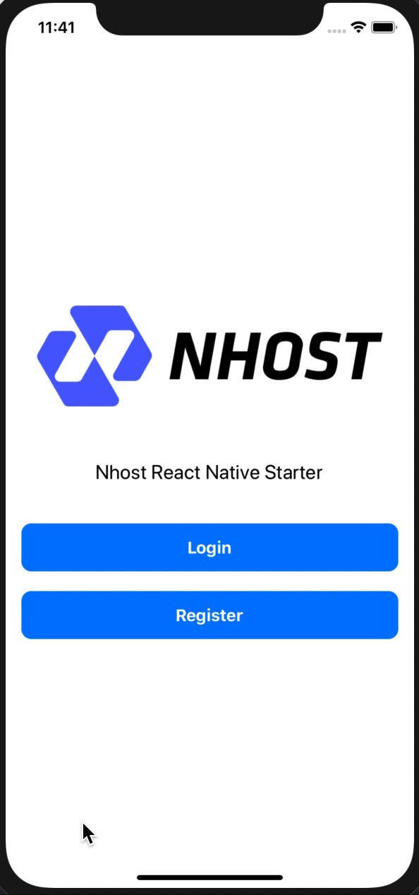

## Nhost React Native Example App

[Nhost](https://nhost.io) example app in React Native using [Hasura](https://hasura.io).

## Get started

1. Create a project on [Nhost](https://nhost.io/register).
2. Clone this repo.
3. Copy `config-example.yaml` to `config.yaml` in `hasura/`.
4. Update `config.yaml` with `endpoint` and `admin_secret` in `hasura/`.
5. Apply migrations and metadata: `cd hasura; hasura migrate apply; hasura metadata apply;`.
6. Copy `config-example.ts` to `config.ts` in `src/`.
7. Update `config.ts` with the details from you project at Nhost.
8. `yarn install`.
9. `yarn start`.


## Creating React Native Project

```javascript
npx react-native init <Project Name>
```

---------------------------------------------------------------------------------------------------------------------------
## Adding the apis
Creating a file `src/helpers/api.js`

```
export const GRAPHQL_ENDPOINT = 'https://hasura-[id].nhost.app/v1/graphql';
export const BACKEND_ENDPOINT = 'https://backend-[id].nhost.app';

export const X_HASURA_ADMIN_SECRET = '<Your_Secret>';
```

---------------------------------------------------------------------------------------------------------------------------

## Adding nhost-js-sdk 

##### Installation

`npm install --save nhost-js-sdk`


##### Initialising Nhost Auth & Storage
Creating a file `src/helpers/nhostSdk/index.js`

```
import nhost from 'nhost-js-sdk';
import { BACKEND_ENDPOINT } from '../api';

const config = {
  endpoint: BACKEND_ENDPOINT,
};

nhost.initializeApp(config);

const auth = nhost.auth();
const storage = nhost.storage();

export { auth, storage };

```

##### Checkout the full usage of Auth and Storage [here](https://github.com/nhost/nhost-js-sdk).

## A Simple Working Auth can be found in this repo.

##### Working GIF

| iOS                                          | Android                                      |
|----------------------------------------------|----------------------------------------------|
|                         |                                              |

---------------------------------------------------------------------------------------------------------------------------

## Working with GraphQL

Look at the file in  `src/helepers/getRequestObject.js`

```
import { GRAPHQL_ENDPOINT, X_HASURA_ADMIN_SECRET } from "./api";

export const getRequestObject = ({ data, token }) => ({
  method: 'POST',
  url: GRAPHQL_ENDPOINT,
  data,
  headers: {
    Authorization: `Bearer="${token}"`,
    'x-hasura-admin-secret': X_HASURA_ADMIN_SECRET
  },
})

// A Sample GraphQL Query
export const getSkills = () => {
  return {
    query: `query getSkills {
      tags {
        tag
      }
    }`
  }
}

// A function which returns a response to the axios request, wrapping the graphQL Function 
const fetchSkills = async (_, token) => {
  const response = await axios(
    getRequestObject({
      data: getSkills(),
      token
    })
  );
  return response;
}

```

Every `query` or `mutation` can be composed as shown above. 


